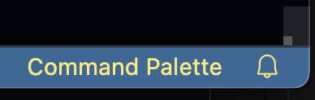

Command Palette  VSCode Extension

This extension will add command palette button to status bar in the right-bottom of your VSCode editor.
This a simple extension to quickly access the command palette instead of remembering keyboard shortcut.

99% of the credit goes to natqe whose extension I forked and modified to work for the command palette.

Known Issues

none.

0.0.1

Enjoy!

Donate

If you find this extension useful, please feel free to donate here. Thanks!

​
